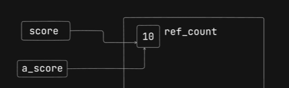
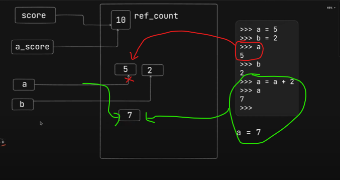
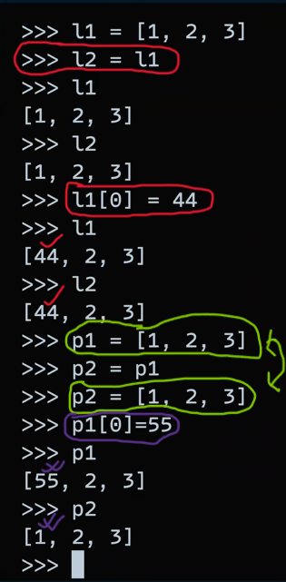
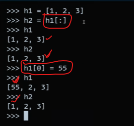
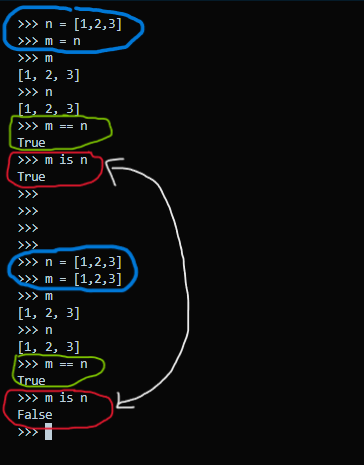

# Internal Working of Pyton

## 1. ref_count:

- In python, `variable type` is not assigned to the `variable name`. Rather type is assigned to the `values of the variables`. In the example above, `number type` is not assigned to `score` or `a_score`, rather it is assigned to the value `10`.
- As we see in the above image the value 10 is reffered by two variables named `score` and `a_score`. So, there must be a machanism in Python where number of references of an assigned value is stored and yes we call them `ref_count`.

## 2. Variable reference change in Python

- in the image above as the `reference of variable` changes from `5 to 7`, we can assume the internal gargbage collector of Python `remove` the value `5` from memory `immediately`. But in Python `number` and `string` type values still remains in the momory until some conditions are full filled.

## 3. Mutability of List

- In the image above different variable name `l1,l2` are `reffered to a single list [1, 2, 3]`. As List are mutable, while the l1[0]'th value changes, l2[0]'th value also changes.
- On the other hand variable `p1 and p2` are `reffered twords two different lists with same value [1, 2, 3]`. So, while the value p1[0]'th changes, p2[0]'th remains as same before.

## 4. Referencing after slicing

- In the image above varible h1 is sliced(h1[ : ]) and reffered to h2. While slicing a List, python made a new copy of list that assigned to h2. After that a sliced result of h2 is shown as output.
- As h1 and h2 refferd to two different copy of [1,2,3], changing h1[0]'th value doesn't affect h2[0]'th value.

## 5. 'is' operator in terms of referencing

- In the image examples above, Firstly, n and m are referenced to same list object [1,2,3], That's why `m == n` is `true` and `m is n` is also `ture`.
- Secondly, n and m are referenced to differt List object with same value [1,2,3]. That's why `m == n` is `true` but `m is n` is `false`.
