# Numbers in depth in Pyton

## 1. Explicity:

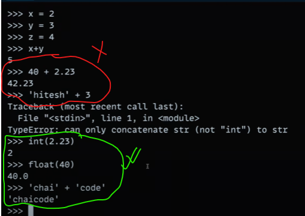

- Try to be explicit and precise whle dealing with numbers in Python

## 2. Dealing Numbers:

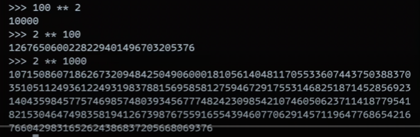

- Python is very efficent while dealing with numbers.

## 3. Touple:

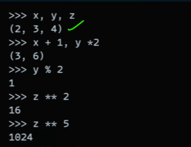

- (x,y,z) = (2,3,4), this touple can be manupulated through differnt way.

## 4. Difference between repr(),str(),print()

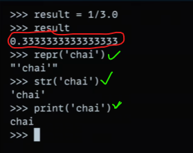

- `repr()` provides a string representation that is meant to be unambiguous and useful for developers.
- `str()` provides a human-readable string representation.
- `print()` is a function for displaying values in a readable format. In the case of `print()`, it implicitly uses `str()` to convert the object to a string before printing.

## 5. Comparisons :

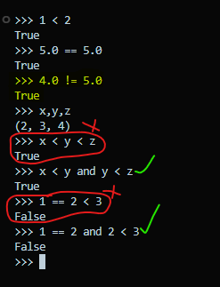

- Be very coautious while comparing numbers.

## 6. Python Library - Math :

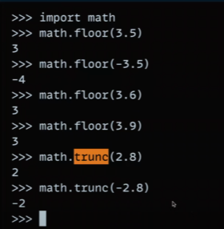

- `math.floor()` - Goes twards the lower boundary whole number.

- `math.trunc()` - Goes twards the value zero according to number line.

## 7. Number Precision :

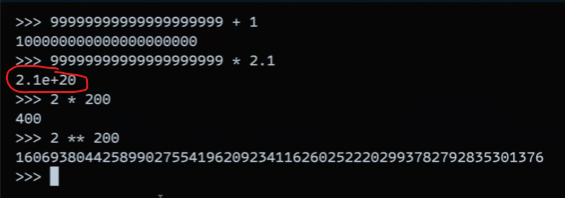

- Number precision is almost infinite in python, means it can deal with very large number set with ease.

- The output like `2.1e+20` does not support the proposition i stated above. We will deal with later.

## 8. Binary, Octal, Hexadecimal :

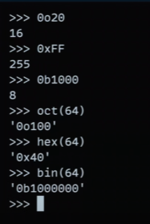

- Different way to get Binary, Octal and Hexadecimal number.

## 9. Integer to Binary, Octal and Hexadecimal :

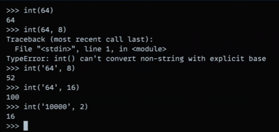

- An easier approch to get any number format from intger numbers.

## 10 Import `random()` module:

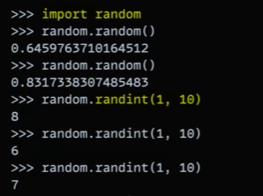
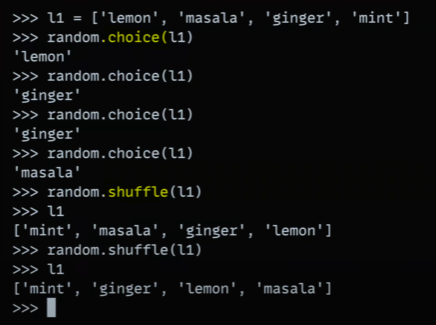

- Different types of random methods mentioned above.

## 11. Import Decimal , Fraction :

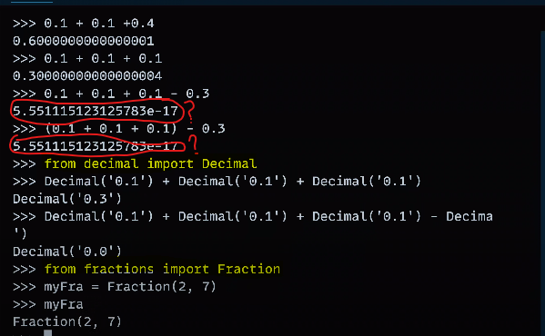

- Sometimes Python give weired results while dealing with decimal or fraction. In those cases we need to import `Decimal` or `Fraction` modules.

- Secondly,

## 12. Set :

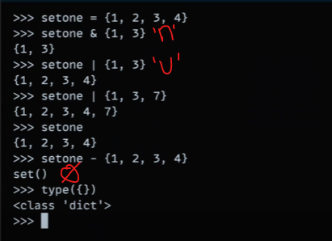

- `Set` is just like the mathematical set

- An empty set is denotes as `set()` , not `{}`. Because `{}` denotes as Dictionary in python.

## 13. Boolean :

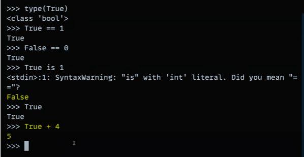

- In the Python `True` is regarded as `1`

- value of `true is 1` is `false` because `true` and `1` are referenced from two difference location in the memory.

## 14.

- In the

- Secondly,

## 15.

- In the

- Secondly,
